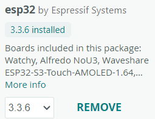
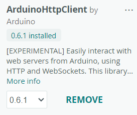
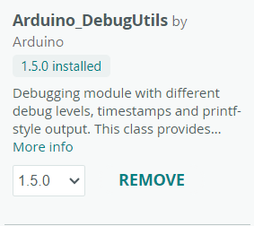
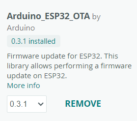
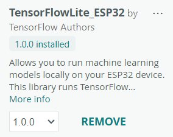

## Required Softwares: Arduino IDE
https://downloads.arduino.cc/arduino-ide/arduino-ide_2.3.7_Windows_64bit.exe

## Board Configurations Required:
1) esp32 by  Espressif Systems

## Libraries Required:

1) ArduinoHttpClient by Arduino

2) Arduino_DebugUtils by Arduino

3) Arduino_ESP32_OTA by Arduino

4) TensorFlowLite_Esp32 by TensorFlow Authors

